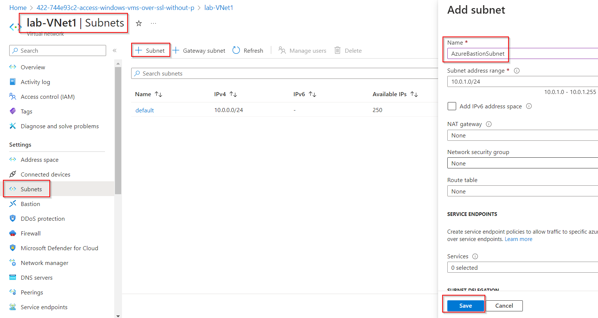
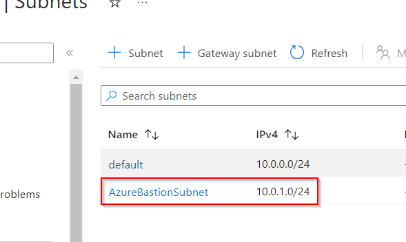
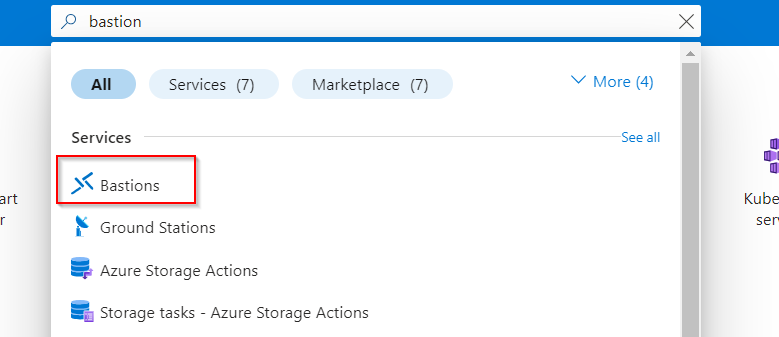
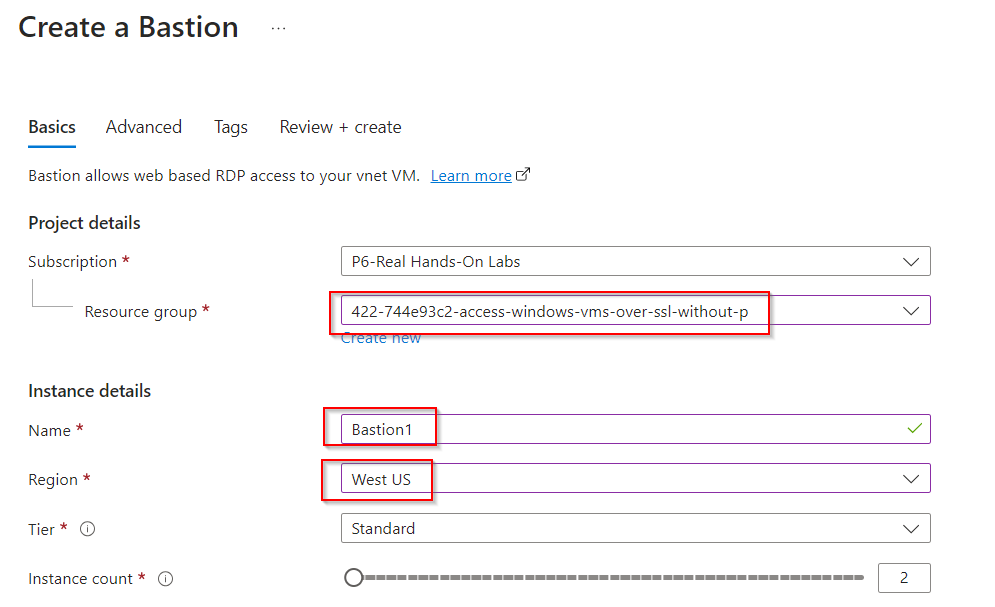
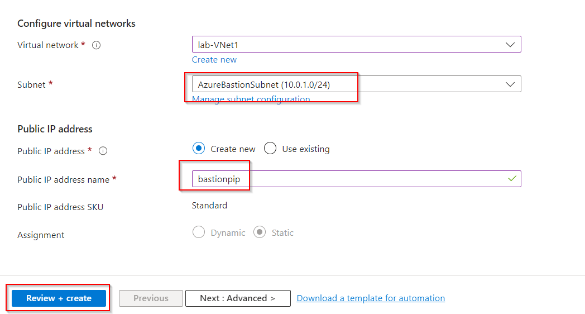
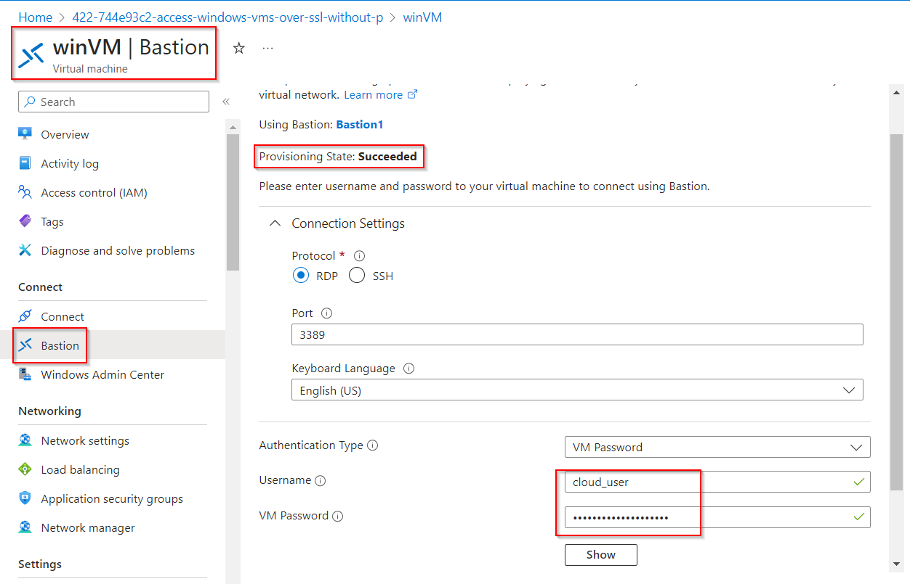
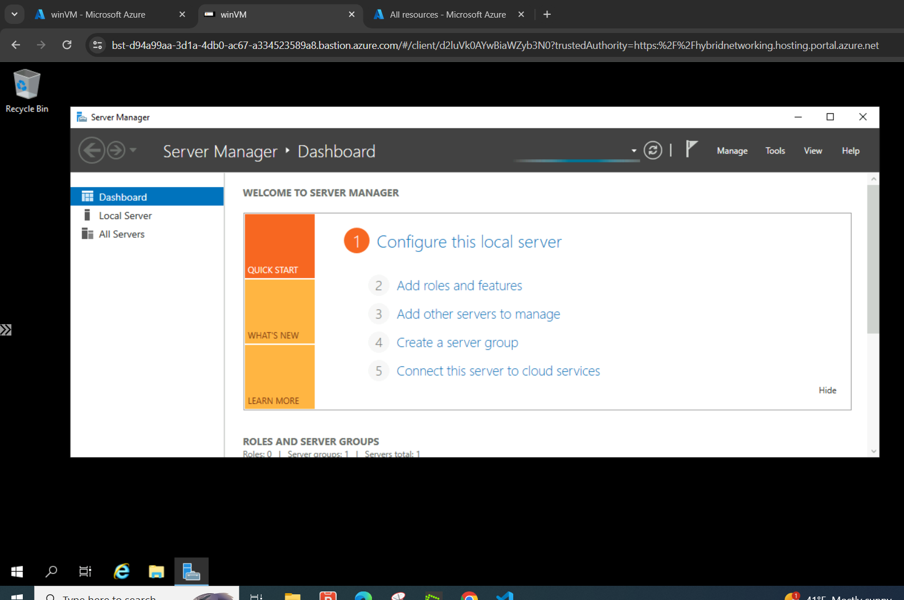

# Access Windows VMs over SSL without Public IPs Using Azure Bastion

**There are 3 objectives with this lab:**
* Create an Azure Bastion Subnet
* Create an Azure Bastion Service
* Connect to the Windows VM via Bastion

## Create an Azure Bastion Subnet

Lets get started by logging into the portal and then heading to our VNet to create a subnet for Azure Bastion. Under your Vnet, head to Settings > Subnets. Click `+ Subnet` to add a subnet. A panel on the right side of the screen should pop up. We're naming our subnet `AzureBastionSubnet` and leaving all the other fields as default. Click Save

After that's completed, your new subnet should be on the Subnet page.

Lets move to step 2!

## Create an Azure Bastion Service

Now we need to create the Azure Bastion. Search `Bastion in the search bar at the top of portal. Click on Bastions and hit create. 

Make sure you choose the correct resource group and location. If not, your Vnet and subnet won't appear. We'll give the service the name `Bastion1`

Once you choose your Vnet and the AzureBastionSubnet, you'll also need to create a Public IP (PIP). Lets give that the name `bastionpip`.

Now, hit Create and your Azure Bastion service should be deployed! This will take about 10 minutes so give it some time. 

On to the final objective!

## Connect to the Windows VM via Bastion

Now, we'll travel to our virtual machine (VM) and connect to it using Bastion instead of SSH or RDP. Navigate to Connect > Bastion. Make sure that the provisioning state says Succeeded or you won't be able to connect yet. Put the username and password that A Cloud Guru (ACG) listed in the lab into the correct fields and then click connect. 

A new window should pop up in your browser which will be the environment of your VM!

Lab completed!

## Personal Notes

This lab was very easy and very useful. It gives us another way to connect to our VMs without exposing our public IP or worrying about additional RDP and SSH sessions. Very useful. 

**Update:** I'm just testing out pushing updates to my GitHub repos from VSC. Lets see if this works. 

